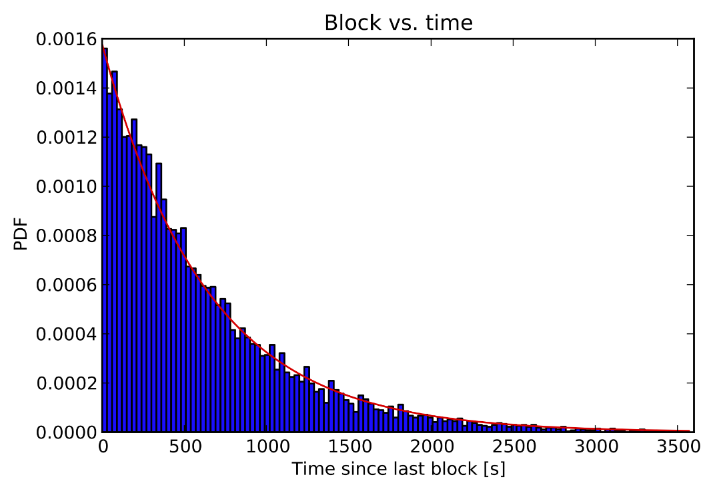
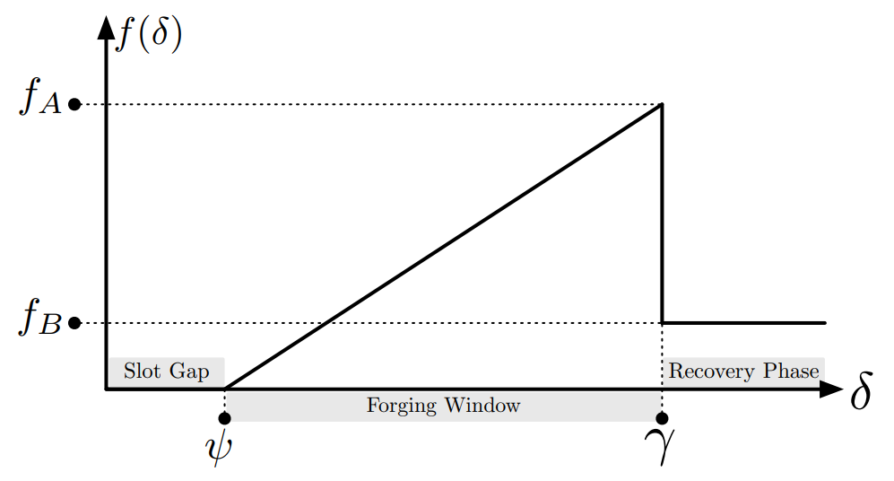
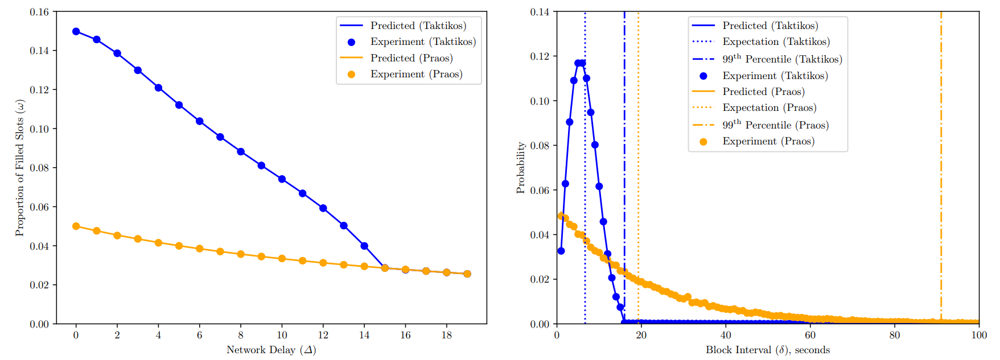

# Taktikos Consensus
### How is the Topl protocol secured?
A blockchain’s consensus algorithm plays a crucial role in its overall design, directly governing the rules of transaction confirmation and indirectly determining a chain’s energy footprint and level of decentralization. The importance of blockchain consensus leads protocol designers to endeavor to closely balance solid fundamentals with promising advances. This is exactly what Topl’s team has achieved with the creation of its proof of stake (POS) protocol, Taktikos, the first regularized Nakamoto consensus protocol.

## Background

There are several advantages to Nakamoto-style consensus protocols compared to those built atop of BFT (Byzantine Fault Tolerant) models:

**Fully dynamic.** BFT protocols require stake lockup periods and explicit registration of participants, making them inherently less dynamic and open. In contrast, Nakamoto protocols, named after the creator of Bitcoin as the first such protocol, do not require stake lookup periods and can function with fully open and dynamic sets of participants.

**Reduced overhead.** BFT protocols contrast with Nakamoto protocols in that they require explicit voting on each new block by a large number of participants–each individual’s vote must be shared with every other voting participant individually for every new block added. Meanwhile, Nakamoto protocols provide a secure mechanism for rotating leader election whereby each new block needs only be confirmed by the randomly chosen block producer for that round. This change in design substantially reduces the number of messages needing to be passed around merely for voting, providing more bandwidth for increased transaction throughput.

**Improved resilience.** Nakamoto protocols require a minimum of 50% + 1 honest participation to remain secure and active. As long as just over half of the stake in the system is participating honestly and not attempting to stall or corrupt the network, the system will work as designed. However, BFT protocols have a higher requirement and can be halted if, instead of 50%, a mere 33% of the system’s stake decides to act dishonestly.

Embracing the ideas of open and collaborative innovation, Topl developed Taktikos from a common research framework first used by IOG in . As such, Taktikos inherits a strong and well-researched foundation upon which to build.

## Long tails and slot-based consensus
In order to solve the problem of network stalls and block irregularity inherent in any Nakamoto consensus protocol, Topl developed Taktikos. One of the key drawbacks of Nakamoto consensus has been high variability in the timing of block production—such consensus protocols can be considered non-regular. While block time for Bitcoin is set at 10 minutes, this is only an average, and there is a long tail where a new block may not arrive for hours. While the plot below shows the block time distribution specifically for the Bitcoin chain, this form of exponential distribution for block times is a feature of all blockchains leveraging Nakamoto-style consensus.

*Probability Density Function (PDF) of block time intervals in the Bitcoin network, showing that while the average block time may only be 10 minutes (600 seconds), it is not uncommon for stalls in block production to last significantly longer.*

The innovation of Taktikos is the introduction of what we have dubbed local dynamic difficulty. Like other proof-of-stake consensus protocols, Taktikos is round-based, meaning that blocks are created and added in set rounds, with forgers each having a stake-dependent probability of producing a valid block to extend the chain. However, Taktikos is unique in that the probability of block creation is not constant and uses slots to act as a clock to evolve the difficulty of producing a block over time. This perturbation aims to regularize the production of new blocks so that blockchain stalls are minimized.

While many potential difficulty curves were considered and simulated, one curve, in particular, stands out for the chain growth and security properties it produces, the snowplow curve (below).

*The time between blocks is shown on the x-axis; the y-axis corresponds to the value of the active slot coefficient, or difficulty, at a given slot interval.*

The snowplow curve allows for blocks to be produced across two distinct periods, the "forging window" and the "recovery phase". The effect of this curve, with a notable discontinuity between the two periods (the cutoff), is to transform the distribution of new block production from the exponential distribution found in other protocols to a tight bell curve(-like) distribution, named the Taktikos distribution, centered on the average block time (below, right). As is explored further in Topl’s technical paper on Taktikos (in submission), usage of the snowplow curve and the resulting Taktikos distribution produces four primary benefits.

*(Left) The proportion of slots filled with at least one block as a function of network delay for both Taktikos and its primary alternative, Ouroboros Praos. (Right) Probability of block production as a function of time in seconds for Taktikos and Ouroboros Praos.*

**Block predictability.** First, and perhaps most simply, Taktikos provides greater predictability in block production. By weighting block production into the forging window, Topl’s consensus protocol concentrates the average time it takes for a block to be produced, giving the network greater predictability and preventing network stalls.

**Increased throughput.** Turning to the matter of throughput, the consideration becomes efficiency. First, as can be seen in the above-left figure, there is increased efficiency because of the increased proportion of non-empty blocks. Additionally, introducing a slot gap or artificial delay placed before the active forging window produces more manageable block propagation, reducing the number of network reorgs.

**Transaction speed and finality.** As can be seen in the right side of the above figure, both theoretically and experimentally, Taktikos provides notably better block confirmation times when compared with similar POS protocols. Out of 100 blocks, the slowest block (99th percentile) in Taktikos will still be confirmed before even the average block (50th percentile) in competing protocols with the same security assumptions.

**Reduced adversarial advantage.** Finally, and perhaps most interestingly, when compared to other PoS algorithms, Taktikos minimizes the power of a network adversary. If we consider that all consensus attacks , we again see the benefit of the slot gap as an artificial network delay together with a dedicated forging window. Put simply, the artificial network delay removes any potential advantage an adversary may have as a single party not usually subject to the network delay of honest actors, and the forging window produces a protocol in which the honest majority is provided a perpetual advantage in forging power as blocks trigger blocks supercharging the block production of honest actors.