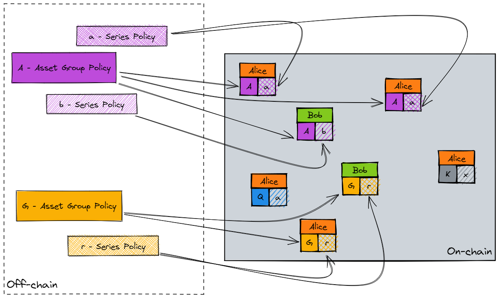

# Transacting with Topl
### How to build atop and interact with the Topl protocol

## Ledger Logic
To provide a blockchain protocol capable of being both performant and featureful, Topl offers a dual-layer ledger logic system consisting of its optimized domain-specific language (DSL), Quivr, along with support for layer 2 Turing-complete smart contracts.
Beyond its functionality for Topl’s modular protocol composition, Quivr, is designed to support the most common functions required for blockchain applications without the need for fully generalized (and more complex) smart contracts.
For the limited cases where Quivr proves to be too limiting, the second half of Topl’s ledger logic system comes into play. Topl has elected to integrate the fully Turing-complete Digital Asset Modeling Language (DAML) into its protocol as a layer 2 solution.

## Quivr DSL
Paired with Topl’s UTXO ledger, the Quivr DSL can be thought of as a system of composable locks that developers can use to power the most common models of dApp functionality without needing to resort to more complex development. At launch, Quivr will support transaction locks composed of any of the following functions. Support for additional functions may be added in the future based on the community's needs.
- AND - used to create locks that are only satisfied if all input conditions are met.
- OR - used to create locks that can be satisfied if any of the input conditions are met.
- NOT - used to create locks satisfiable if the input conditions are false or not met.
- LESS THAN / GREATER THAN / EQUAL TO - used to verify numerical values as a locking and unlocking condition.
- EXACT MATCH - used to create locks that can only be satisfied with an exact byte match.
- HEIGHT / TICK - used to create locks that can be satisfied only once a certain block height or slot number is reached.
- LOCKED - provides support for permanent locking of assets as an alternative to the idea of a burn address.
- SIGNATURE - standard private key lock whereby assets can only be spent (unlocked) with a specified private key.
- THRESHOLD - provides support of m of n threshold signatures.

## Layer 2 Smart Contracts
In order to provide even greater flexibility and use case coverage than offered by Quivr, the Topl protocol supports a Layer 2 smart contract solution using the Turing-complete [Digital Asset Modeling Language (DAML)](https://docs.daml.com/). This open-source smart contract language is based on Haskell and, as such, is a typed, functional language. This design decision makes DAML exceptionally well suited to encouraging safer and more predictable development patterns, as well as improved code audits and analysis.

In 2014, the crypto space shifted from a focus on UTxO-ledger blockchains (Unspent Transaction Output), such as Bitcoin, to account-ledger blockchains, such as Ethereum. This transition was largely driven by the development of the Ethereum Virtual Machine (EVM) and by the model of smart contract execution chosen by the Ethereum team.

While DAML has found strong adoption in private enterprise deployments, it has not yet been integrated with any major public chains, despite numerous improvements over Solidity and other smart contract languages.

Through Topl's DAML integration, users can achieve the following:
- Write and deploy Turing-complete contracts without the substantial gas fees found in EVM-style protocols;
- Achieve privacy domain separation between the public (Layer 1) Topl Blockchain and private (Layer 2) DAML contracts;
- Support bi-directional conditionality with DAML smart contracts capable of being triggered by on-chain transactions and vice versa.

Finally, in addition to the above benefits, separating its Turing-complete smart contract layer into its own domain enables the Topl blockchain to achieve greater scalability.

## Topl Asset Model
Tokenizing non-blockchain assets, whether physical assets, financial contracts, or digital information, is a major opportunity for web3 infrastructures like Topl. Among the most common manner one hears blockchain being applied is to create and track digital twins of X. This idea has become so common around blockchain that it has begun to obscure the hidden complexities in accomplishing this task effectively.

While it may seem trivial to digitize an asset, there are a myriad of hidden assumptions regarding how such tokenization should be accomplished. We expect some things to be divisible and interchangeable while others ought to be fixed and unique, or we assume that there exist some items that can be separated and recombined while there are others whose entropy is irreversible.

Typically, a blockchain protocol includes no guidance or support on methods of tokenization and token management, relying entirely on ad hoc smart contract implementation. Topl choose a different approach and elected to include a robust yet flexible asset model into the protocol itself.

### Asset Lifecycle
To create assets with TAM, a user must first register two distinct policies on chain, a Group Policy and a Series Policy. Through the process of registration, a user commits to certain off-chain data that will govern the properties and behaviors of associated asset tokens on-chain. These properties might include things like supply, restrictions on additional minting, or off-chain metadata These commitments to off-chain data are realized through the creation of two tokens, a Group Token and Series Token respectively, that contain verifiable evidence of the associated off-chain commitments.

*View of TAM assets on the ledger. Each token bundle is owned by either Alice or Bob and each asset token references a Group Policy and a Series Policy.*

### Levels of Fungibility
Because every token is linked to both a Group and a Series, Topl assets have the ability to express two levels of fungibility. Tokens can be specified to be fungible if they share a common Group Policy, if they share a common Series Policy, or if they share both a common Group Policy and Series Policy. The advantage of such a system is to enable a great level of behavioral capture by Topl’s system. Not only does TAM support standards equivalent to well known EVM standards such as ERC-20, ERC-721, and ERC-1155, but it also supports many additional behaviors beyond this.

## dApp Tooling
Brambl gives application developers an easy-to-integrate library that will both enable their application to communicate with the blockchain and carry out all necessary cryptographic functions, including hashing data and signing transactions. Paired with code samples and thorough documentation, Brambl offers a strong example of how to ensure a blockchain is accessible to developers.

To maximize the number of developers and potential dApps that can leverage Brambl, Topl will be releasing this API library for multiple development languages aiming to support 60% of mobile and web development frameworks within a year of token launch. Compared with many other blockchains teams that have only put in the effort to develop a single library (most often in JavaScript), we believe this is a strong testament to our mission of inclusivity and accessibility. 

As the suite of Brambl libraries was developed for the community of Topl developers, it is only appropriate that these developers have the opportunity to contribute to and modify these libraries to better fit their own requirements. As with all software comprising the Topl protocol, Brambl libraries are available as open-source under the Mozilla Public License 2.0.