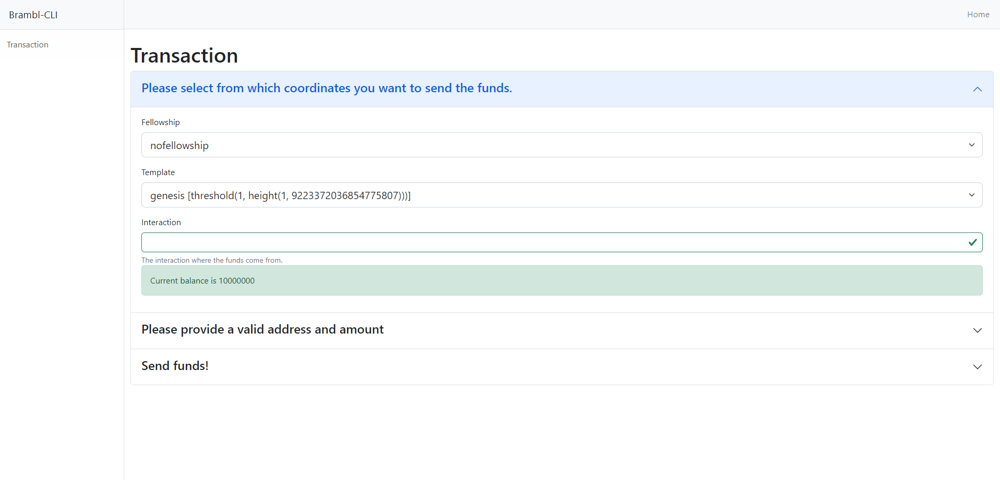

# Start the Graphical Interface

The CLI provides a method to start the graphical interface. This interface is a web application that allows you to interact with the Topl platform and perform some common tasks in an easier
way.

## Start the Graphical Interface

To start the graphical interface, run the following command:

```bash
server init --walletdb $WALLETDB --keyfile $KEYFILE -n $NETWORK --host $HOST --port $PORT --password $PASSWORD
```

This will start the graphical interface on port 3000. The GUI will use
the wallet database file specified in the `--walletdb` option. The
`--host` and `--port` options are used to connect to the Bifrost node.
The `--secure` option is used to specify whether to use HTTPS or HTTP and
is optional.
To access the interface, open a browser and go to the following URL:

```
http://localhost:3000
```

## Send a Transaction

Upon opening the interface, you will be presented with the following
screen:

